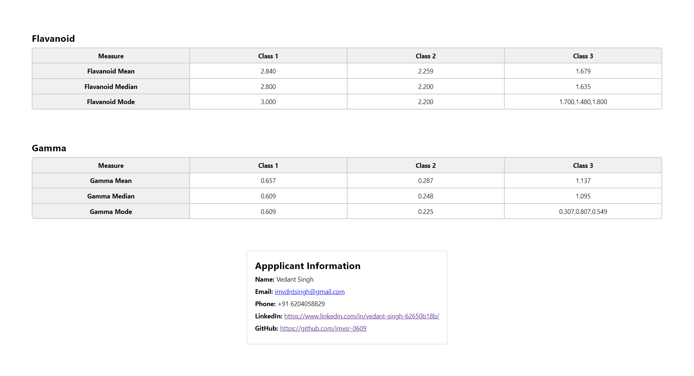

# Manufac Assigment Application

Welcome to the Manufac Assigment Application! This project is built using React and TypeScript as assignment for Manufac hiring.

## Getting Started

Follow these steps to get the project up and running on your local machine:

## Clone the Repository 

   First, clone this repository to your local machine using the following command:

   ```bash
   git clone https://github.com/imvsr-0609/manufac-assignment.git
   ```

## Navigate to the Root Directory:

Change your current directory to the project's root directory using the cd command:
   ```bash
cd manufac-assignment
   ```
## Install Dependencies:

**Install the project's dependencies using yarn:**

 ```bash
yarn install
   ```

## Start the Application:

After the installation is complete, start the development server:

 ```bash
yarn start
   ```
This command will start the React application and open it in your default web browser. You can access it at http://localhost:3000.

## Project Structure

Briefly describe the structure of your project, including key directories and files. You can include a tree structure or a high-level overview.

```
project/
├── src/
│   ├── components/
│   │   └── ...
│   ├── App.tsx
│   └── index.tsx
├── public/
│   ├── index.html
│   └── ...
├── package.json
├── README.md
└── ...
```

## Screenshots


